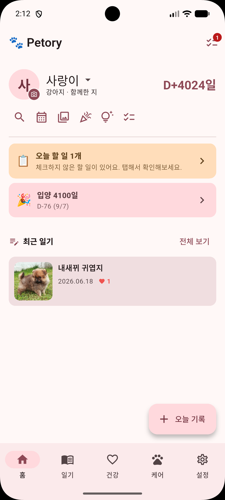
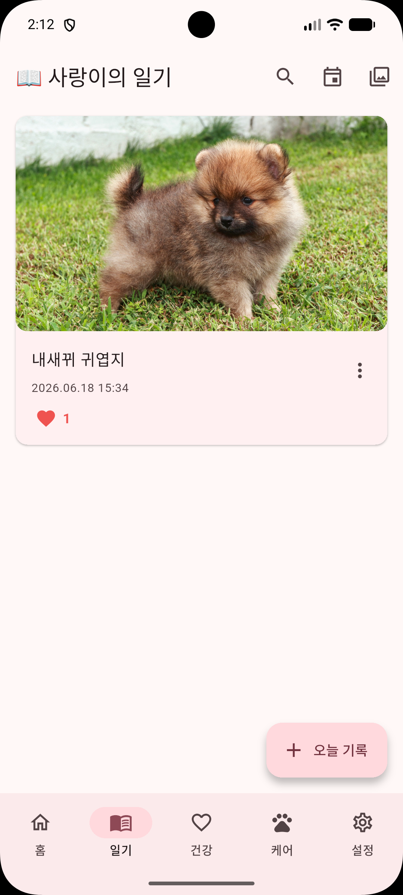
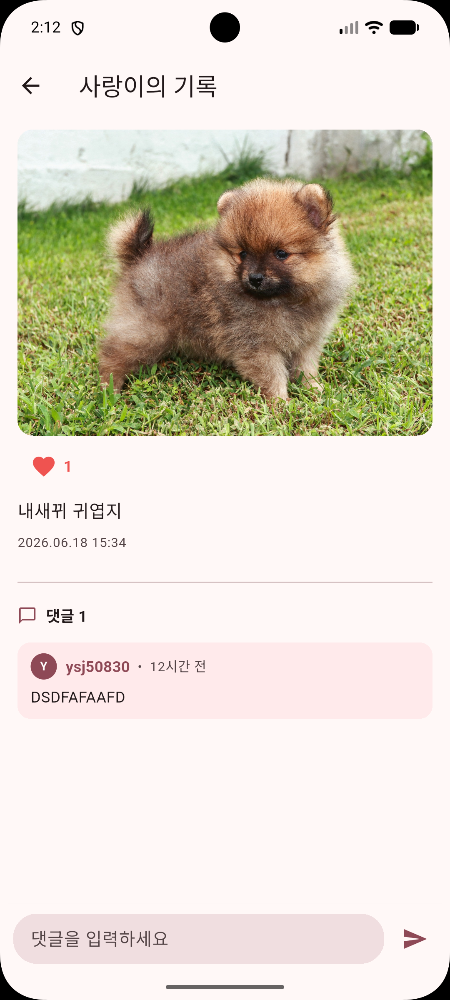
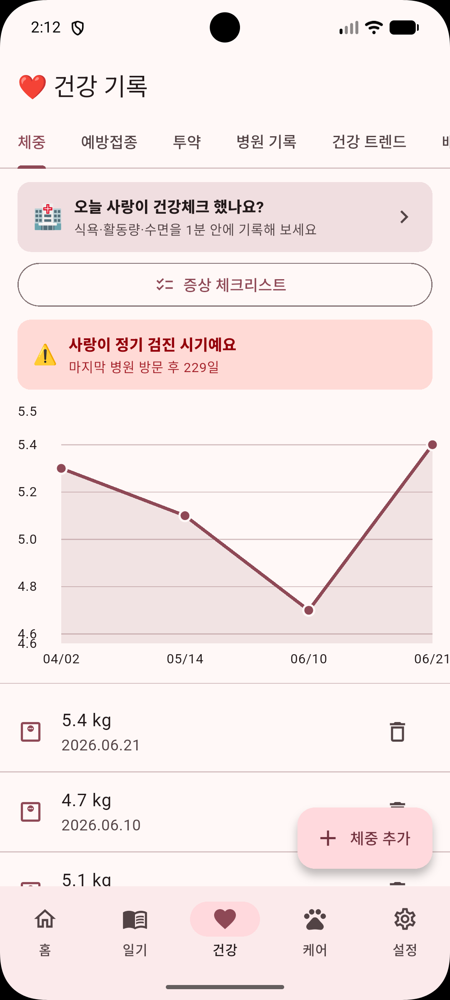
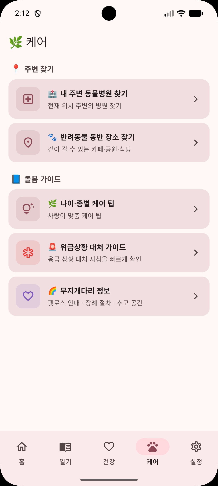
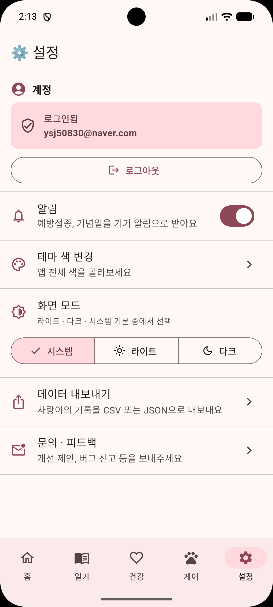
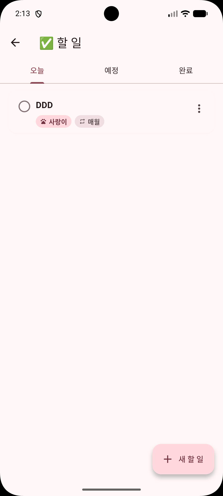
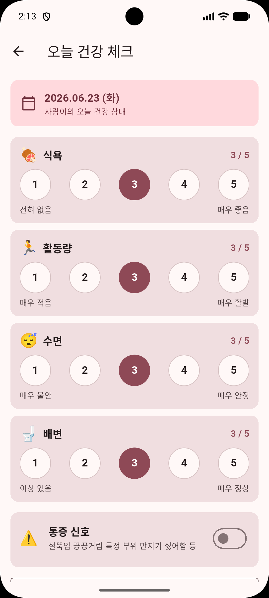
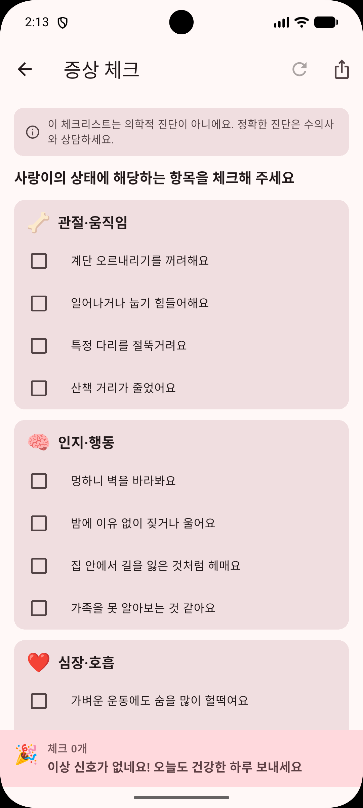

# 🐾 Petory - 반려동물 다이어리 앱

<p align="center">
  
</p>

<p align="center">
  <strong>반려동물과의 모든 순간을 기록하고, 건강을 관리하는 올인원 다이어리 앱</strong>
</p>

<p align="center">
  
  
  
  
</p>

---

## 📱 스크린샷

| 홈 | 일기 | 일기 상세 |
|---|---|---|
|  |  |  |

| 건강 | 케어 | 설정 |
|---|---|---|
|  |  |  |

| 할 일 | 매일 건강체크 | 증상 체크 |
|---|---|---|
|  |  |  |

---

## ✨ 주요 기능

### 🏠 홈
- 펫 프로필 사진 + D+일수
- 오늘 할 일 · 기념일 배너
- 최근 일기 미리보기
- 여러 반려동물 전환

### 📖 일기
- 사진 여러 장 + 동영상 업로드
- 타임라인 뷰 + 날짜/키워드 검색
- 하트(좋아요) + 가족 댓글
- 사진 갤러리 뷰

### ❤️ 건강 관리
- **체중** — 그래프로 변화 추이
- **예방접종** — 일정 관리 + 알림
- **투약/영양제** — 스케줄 + 시간 알림
- **병원 기록** — 증상·진단·비용
- **배변 기록** — 형태·색깔 기록 + 이상 감지
- **음수 기록** — 일일 음수량 + 목표 달성률
- **미용 기록** — 시술 항목 + 다음 예정일 알림 + 미용실 찾기
- **발정기 관리** — 주기 기록 + 다음 예상일 알림
- **매일 건강체크** — 식욕·활동량·수면·배변·통증 (노령 펫)
- **건강 트렌드** — 30일 추이 차트 (노령 펫)

### 🌿 케어
- **나이·종별 케어 팁** — AAHA/AAFP 가이드라인 기반
- **증상 체크리스트** — 관절·인지·심장·소화·피부 (노령 펫)
- **위급상황 대처 가이드** — 응급 상황별 대처법
- **무지개다리 정보** — 펫로스 안내 · 장례 절차
- **내 주변 동물병원 찾기** — 네이버/카카오/구글 지도 연동
- **반려동물 동반 장소 찾기** — 카페·식당·숙소·공원
- **소동물 케이지 관리** — 청소·먹이·물 교체 기록 + 알림

### ✅ 할 일
- 반려동물별 할 일 등록
- 매일/매주/매월 반복 설정
- 알림 + 완료 체크

### 👨‍👩‍👧 가족 공유
- 초대 코드로 가족과 함께 기록
- 일기에 댓글 + 하트
- 실시간 데이터 동기화

### ⚙️ 설정
- 테마 색상 6가지
- 다크 모드
- 데이터 내보내기 (CSV/JSON)
- 계정 생성 + 기기 변경 시 데이터 보존
- 게스트로 바로 시작 가능

---

## 🛠 기술 스택

| 분류 | 기술 |
|------|------|
| **Frontend** | Flutter 3.44.1, Dart |
| **Backend** | Supabase (PostgreSQL, Auth, Storage) |
| **상태 관리** | ValueNotifier, PetSession 싱글톤 |
| **차트** | fl_chart |
| **알림** | flutter_local_notifications |
| **지도** | url_launcher (딥링크) |
| **미디어** | image_picker, video_player |
| **인증** | Supabase Auth (익명 + 이메일) |

---

## 🚀 실행 방법

### 사전 준비
- Flutter SDK 3.44.1 이상
- Android Studio (에뮬레이터용)
- Supabase 프로젝트

### 환경 설정
`lib/supabase_config.dart` 에 Supabase 프로젝트 URL과 키를 설정하세요.

```dart
const supabaseUrl = 'YOUR_SUPABASE_URL';
const supabaseAnonKey = 'YOUR_SUPABASE_ANON_KEY';
```

### 실행

```bash
# 의존성 설치
flutter pub get

# 웹으로 실행
flutter run -d chrome --web-port=8080

# 안드로이드 에뮬레이터로 실행
flutter run

# 릴리즈 APK 빌드
flutter build apk --release
```

---

## 🗄 데이터베이스 구조

```
auth.users
├── pets (반려동물)
│   ├── pet_members (가족 공유)
│   ├── pet_invites (초대 코드)
│   ├── logs (사진 일기)
│   │   ├── log_media (다중 미디어)
│   │   ├── log_comments (댓글)
│   │   └── log_likes (하트)
│   ├── weight_records (체중)
│   ├── vaccinations (예방접종)
│   ├── medications (투약)
│   ├── vet_visits (병원 기록)
│   ├── milestones (마일스톤)
│   ├── grooming_records (미용)
│   ├── heat_cycles (발정기)
│   ├── daily_health_logs (매일 건강체크)
│   ├── poop_logs (배변)
│   ├── water_logs (음수)
│   ├── cage_logs (케이지 관리)
│   ├── cage_schedules (케이지 스케줄)
│   └── todo_items (할 일)
├── feedback (피드백)
└── care_tips (케어 팁, 공개)
```

---

## 📁 프로젝트 구조

```
lib/
├── main.dart
├── supabase_config.dart
├── models/
├── services/
│   ├── auth_service.dart
│   ├── supabase_service.dart
│   ├── notification_service.dart
│   ├── reminder_scheduler.dart
│   └── pet_session.dart
└── screens/
    ├── main_screen.dart       # 하단 네비게이션
    ├── home_screen.dart       # 홈 탭
    ├── diary_screen.dart      # 일기 탭
    ├── health_tab.dart        # 건강 탭
    ├── care_screen.dart       # 케어 탭
    ├── settings_screen.dart   # 설정 탭
    └── ...
```

---

## 🔒 개인정보처리방침

[개인정보처리방침 보기](https://seth0-0in.github.io/petory-privacy/privacy_policy.html)

---

## 👨‍💻 개발자

**TrueWorld Studio**
- GitHub: [@seth0-0in](https://github.com/seth0-0in)

---

## 📄 라이선스

MIT License © 2026 TrueWorld Studio